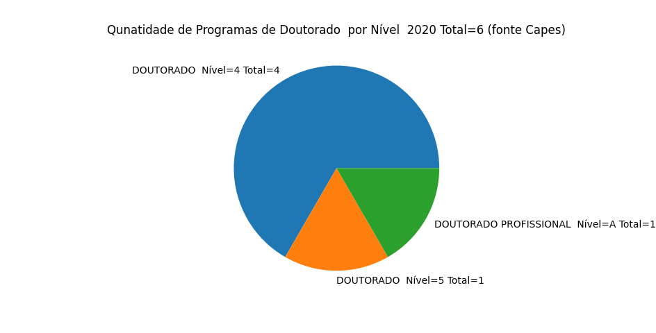

# BI_UNEB

Este projeto apresenta um conjunto de Gráficos com dados da Pesquisa, Pós-Graduação e Inovação da UNEB de 2020 desenvolvidos em Python

O arquivo de dados com as Dimensões, Fatos e ODS estão no Arquivo do Microsoft Access

O mdeolo de dados do Star Schema está representado na figura 

As bibliotecas usadas em Python são:

pip install pyodbc

pip install matplotlib

Observer no código o caminho do arquivo de fonte de dados em Access e altere para o local da sua máquia

conn = pyodbc.connect(r'Driver={Microsoft Access Driver (*.mdb, *.accdb)};DBQ=c:\IC_2020\BI_Pesquisa.accdb;')

O arquivo grafico_ruf.py irá gerar o gráfico: 

O arquivo grafico_projetos.py irá gerar o gráfico: 

O arquivo grafico_programas_pos.py irá gerar o gráfico

O arquivo top_grupos_pesquisa.py irá gerar o gráfico: 

O arquivo grafico_programas_pos.py irá gerar o gráfico: 

O arquivo grafico_quantidade_programas_doutorado_nivel.py irá gerar o gráfico: 

O arquivo grafico_quantidade_programas_mestrado_p_nivel.py irá gerar o gráfico: 

